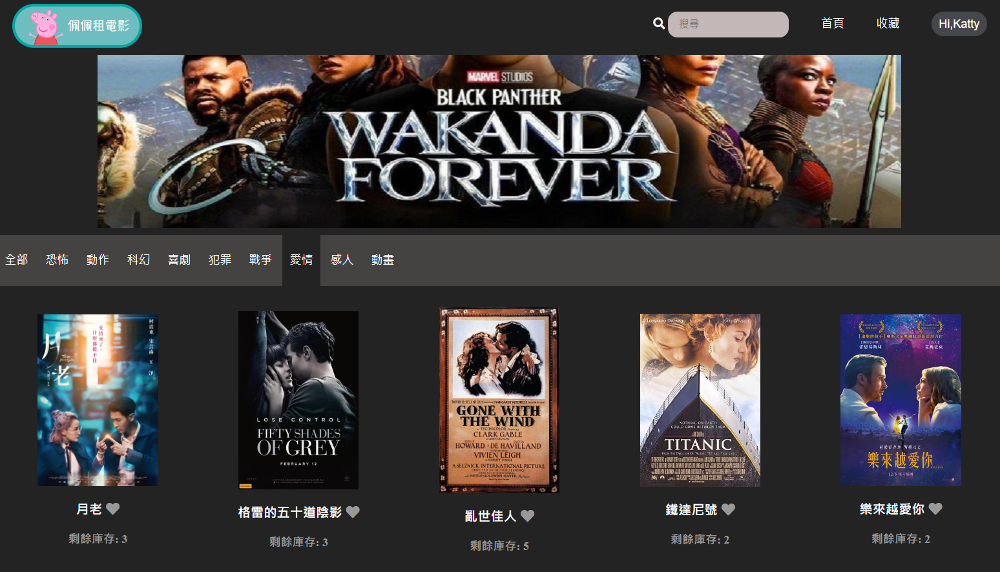
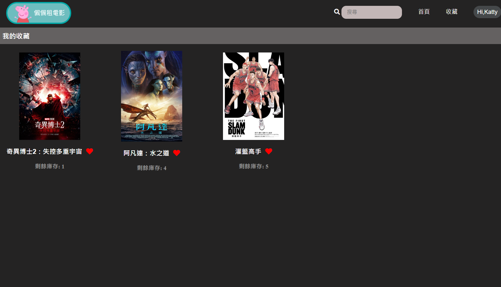
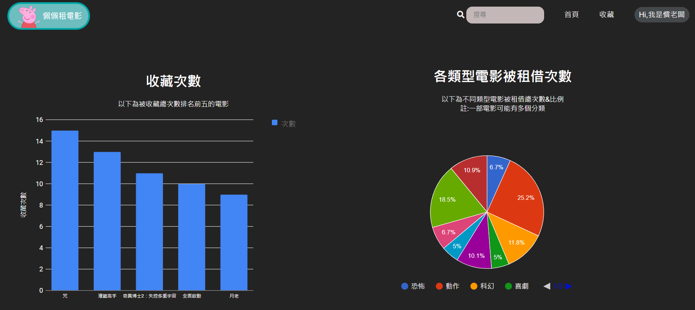

# DVD 租借系統
**團隊成員：張愷旆、王證衡、柯劭潔、洪仁益**
## 系統簡介
此專案以DVD租借店為情境，製作一套系統幫助店家完成DVD的租借與歸還、上架與下架，並提供管理者銷售概況分析。除了店家的操作外，也提供消費者透過網頁瀏覽電影簡介及店內庫存，能夠即時了解店內的架上電影及庫存概況。





## 系統簡介

```
XAMPP v3.3.0
Apache & MYSQL
```
## 技術
- PHP Server
- MySQL
- HTML/CSS
- JavaScript、Ajax

## 功能
- 未登入者能瀏覽、搜尋電影、查看電影詳細資訊內容
- 一般使用者能使用電影收藏功能
- 管理者可查看電影租借紀錄、新增/刪除電影及DVD、辦理會員租借/歸還事項
